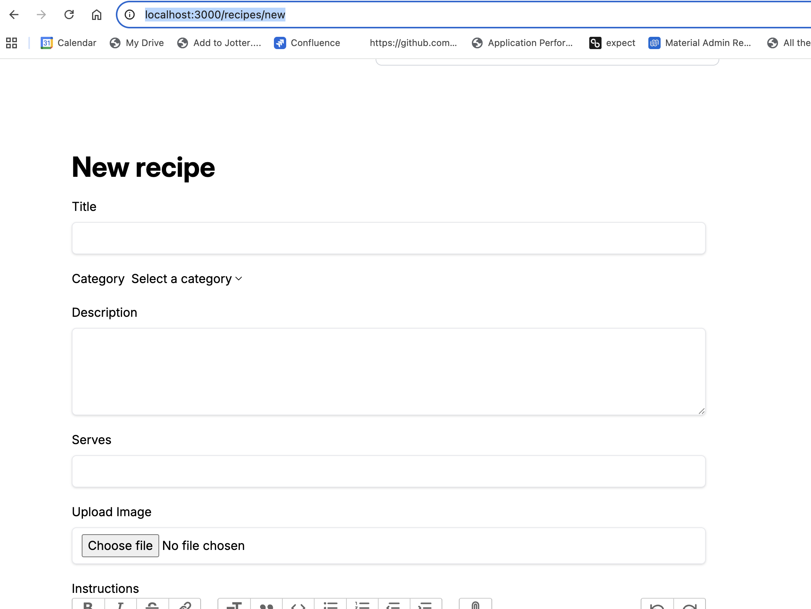
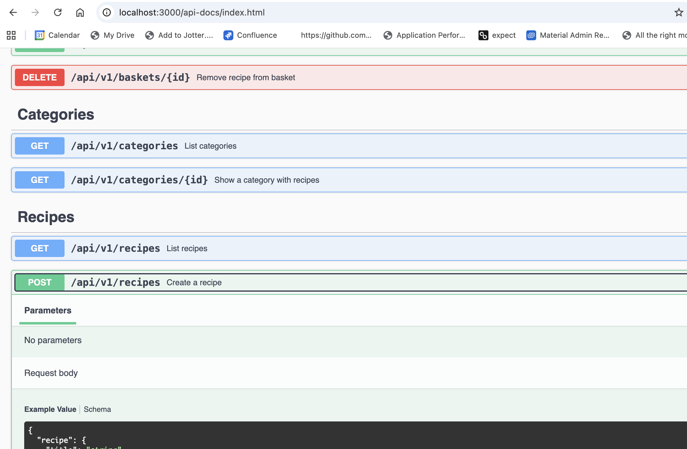
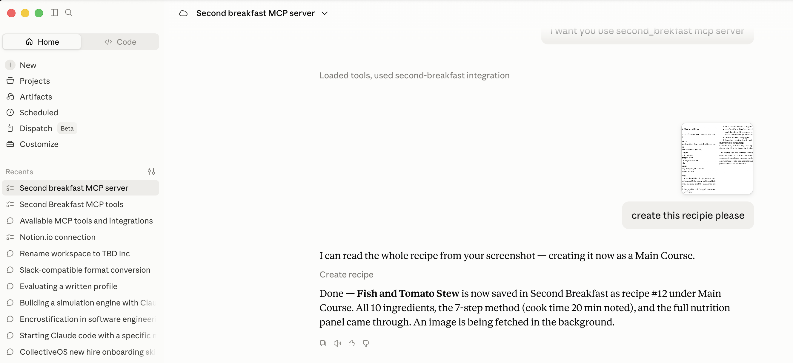

# Second Breakfast

<p align="center">
  
</p>

A recipe discovery and meal planning application built with Ruby on Rails. Browse recipes, add them to your basket, and generate aggregated shopping lists for your chosen meals.

## Features

- **Recipe Browsing** - Browse recipes with search by title and ingredients
- **Categories** - Organized by meal type (Breakfast, Lunch, Dinner, Desserts)
- **Weekly Meal Plans** - Plan Monday-Sunday, one plan per week, with an auto-fill option that picks a breakfast, lunch and dinner for every day. Draft plans are editable; accept a plan to lock it (reopen until the week ends); past weeks archive automatically as read-only history
- **Saved Recipes** - Bookmark recipes into a pool that feeds the meal plan picker
- **Smart Shopping Lists** - Automatically aggregates ingredients across a plan's recipes, with print and copy
- **Rich Content** - Full recipe details with images, prep time, servings, and nutrition info

## Tech Stack

- **Framework:** Ruby on Rails 8.1
- **Ruby:** 3.3.1
- **Database:** PostgreSQL
- **Frontend:** Tailwind CSS, Hotwire (Turbo + Stimulus)
- **Background Jobs:** Solid Queue
- **Caching:** Solid Cache
- **Deployment:** Docker + Kamal

## Getting Started

### Prerequisites

- Ruby 3.3.1
- PostgreSQL
- Node.js

### Setup

```bash
# Install dependencies and set up database
make local.setup

# Or manually:
bundle install
bin/rails db:create db:migrate db:seed
```

### Running the App

```bash
make local.run
# or
bin/dev
```

Visit http://localhost:3000

### Default User

After seeding, you can log in with:
- Email: `me@swm.cc`
- Password: `pass5577`

## Development Commands

| Command | Description |
|---------|-------------|
| `make local.setup` | Full setup (gems, db create, migrate, seed) |
| `make local.run` | Start the development server |
| `make local.test` | Run the test suite |
| `make console` | Rails console |
| `make lint` | Run RuboCop |
| `make local.brakeman` | Security scan |
| `make local.db.migrate` | Run pending migrations |
| `make local.db.seed` | Seed the database |

## Project Structure

```
app/
├── controllers/    # Request handling
├── models/         # User, Recipe, Basket, Category
├── views/          # ERB templates
└── javascript/     # Stimulus controllers

config/             # Rails configuration
db/                 # Migrations and seeds
```

## Database Schema

- **users** - Authentication and user accounts
- **recipes** - Recipe data with JSON ingredients and nutrition
- **categories** - Recipe categorization
- **baskets** - User recipe selections (join table)

## Creating Recipes

There are three ways to create recipes in Second Breakfast:

### 1. Web UI

The simplest way - just fill in the form at `/recipes/new`.



### 2. REST API

Create recipes programmatically via the API. Requires authentication.



```bash
curl -X POST http://localhost:3000/api/v1/recipes \
  -H "Authorization: Bearer sb_your_api_key" \
  -H "Content-Type: application/json" \
  -d '{
    "recipe": {
      "title": "Pancakes",
      "description": "Fluffy breakfast pancakes",
      "serves": 4,
      "prep_time": "20 minutes",
      "category_id": 1,
      "instructions": "Mix ingredients. Cook on griddle.",
      "ingredients": [
        {"name": "flour", "quantity": "200", "unit": "g"},
        {"name": "eggs", "quantity": "2", "unit": "whole"}
      ],
      "nutrition": {
        "calories": "250", "protein": "8", "fat": "5",
        "carbs": "40", "fibre": "2", "sugar": "10", "sodium": "300"
      }
    }
  }'
```

An image will be automatically fetched in the background based on the recipe title.

### 3. MCP Server (Claude Integration)

The fastest way to import recipes - take a photo and let Claude do the work.



1. Take a photo of a recipe from a cookbook
2. Send it to Claude Desktop with the MCP server configured
3. Ask: "Create a recipe from this photo"
4. Claude extracts all details and creates the recipe instantly

See [MCP Server documentation](mcp-server/README.md) for setup instructions.

## API

Interactive API documentation available at [/api-docs](/api-docs) (Swagger UI).

### Endpoints

| Method | Path | Auth | Description |
|--------|------|------|-------------|
| GET | `/api/v1/recipes` | Yes | List recipes (paginated) |
| GET | `/api/v1/recipes/:id` | Yes | Show recipe |
| GET | `/api/v1/recipes/search?query=` | Yes | Search recipes |
| POST | `/api/v1/recipes` | Yes | Create recipe |
| PUT | `/api/v1/recipes/:id` | Yes | Update recipe |
| DELETE | `/api/v1/recipes/:id` | Yes | Delete recipe |
| GET | `/api/v1/categories` | Yes | List categories |
| GET | `/api/v1/categories/:id` | Yes | Category with recipes |
| GET | `/api/v1/baskets` | Yes | User's basket |
| POST | `/api/v1/baskets` | Yes | Add recipe to basket |
| DELETE | `/api/v1/baskets/:id` | Yes | Remove from basket |
| GET | `/api/v1/meal_plans` | Yes | List weekly meal plans (`?filter=active\|archived`) |
| POST | `/api/v1/meal_plans` | Yes | Plan a week (`auto_fill: true` picks a breakfast, lunch and dinner per day) |
| GET | `/api/v1/meal_plans/:id` | Yes | A plan's Monday-Sunday grid |
| POST | `/api/v1/meal_plans/:id/accept` | Yes | Lock a plan |
| POST | `/api/v1/meal_plans/:id/reopen` | Yes | Unlock (until the week ends) |
| GET | `/api/v1/meal_plans/:id/shopping_list` | Yes | Aggregated ingredients for the week |
| POST | `/api/v1/meal_plans/:id/entries` | Yes | Add a recipe to a day |
| DELETE | `/api/v1/meal_plans/:id/entries/:id` | Yes | Remove a recipe from a day |

### Authentication

**Every** endpoint requires an API key sent as a Bearer token:

```
Authorization: Bearer sb_your_api_key
```

Create a key from the **Account** page (`/account`, API Keys section): name it,
click **Create key**, and copy the `sb_...` token — it is shown exactly once and
cannot be retrieved again. Revoke keys from the same page; revocation takes
effect immediately.

## MCP Server (Claude Integration)

An MCP server is included for integrating with Claude, enabling rapid recipe import from photos.

### Quick Start

```bash
cd mcp-server
npm install
```

Add to Claude Desktop config (`~/Library/Application Support/Claude/claude_desktop_config.json`):

```json
{
  "mcpServers": {
    "second-breakfast": {
      "command": "node",
      "args": ["/path/to/second_breakfast/mcp-server/index.js"],
      "env": {
        "API_TOKEN": "your-token-here"
      }
    }
  }
}
```

### Example Usage

Take a photo of a recipe and ask Claude:

> "Create a recipe from this photo of my cookbook"

Claude will extract the recipe details and create it using the MCP server.

See [mcp-server/README.md](mcp-server/README.md) for full documentation.

## Deployment

Deployed using Kamal with Docker containers. See `config/deploy.yml` for configuration.

```bash
kamal setup    # Initial deployment
kamal deploy   # Deploy updates
```

## License

Private project.
